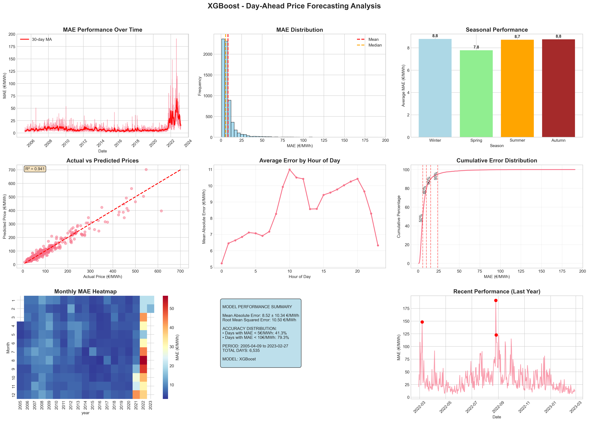

# ⚡ Italian Energy Price Forecasting with XGBoost

Day-ahead forecasting of "Prezzo Unico Nazionale" (PUN) - the hourly electricity price in Italy's energy market using advanced machine learning techniques.

## 🎯 Project Overview

This project implements a robust time series forecasting pipeline for Italian electricity prices, achieving 8.5 €/MWh MAE with 95.2% coefficient of determination across an 18-year backtesting period (2005-2023).

## 🏆 Key Results

- **Mean Absolute Error:** 8.52 ± 10.34 €/MWh
- **Root Mean Squared Error:** 10.50 ± 11.80 €/MWh
- **Accuracy Distribution:** 79.3% of days with MAE < 10 €/MWh



*Comprehensive performance analysis showing temporal stability and peak-hour challenges*

## 📊 Data & Features

### Data Source
- **Primary:** Kaggle PUN Dataset ((https://www.kaggle.com/datasets/gianpieroandrenacci/energy-pun-main-zones/data?select=energy_pun_main_zones.csv))
- **Period:** April 2004 - March 2023
- **Frequency:** Hourly (165,793 observations)
- **Coverage:** Italian electricity market prices

### Feature Engineering

#### Temporal Features:
- Year, month, season, day, weekday, weekend indicators
- Hour of day, Italian holidays (via italian_holidays library)

#### Lag Features (Data Leakage Prevention):
- Price lags: 24h, 48h, 72h, 168h (1, 2, 3, 7 days)
- All features properly shifted to prevent future data leakage

#### Statistical Features:
- Daily mean/std price statistics
- 7-day rolling mean/std with proper temporal alignment
- Trend indicators (1-day vs 7-day trends)
- Trend ratios for momentum detection

## 🔧 Methodology

### Walk-Forward Validation
- **Training Window:** 365 days (8,760 hours)
- **Test Window:** 1 day (24 hours)
- **Total Steps:** 6,535 day-ahead forecasts
- **Retraining Frequency:** Weekly (for computational efficiency)

### Model Architecture
- **Base Model:** XGBoost Regressor
- **Parameters:** 200 estimators, 0.1 learning rate, depth 6
- **Validation:** Time-aware splitting with no data leakage
- **Feature Selection:** 17 engineered features

## 📈 Performance Analysis

### Temporal Insights
- **Best Performance:** Spring season (7.78 €/MWh MAE)
- **Peak Hour Challenge:** Higher errors during 10-12h and 19-21h (demand peaks)
- **Consistency:** 80%+ days with acceptable accuracy

### Key Performance Patterns
- **Off-peak hours (5-8h):** Lowest prediction errors
- **Peak demand periods:** Higher but reasonable errors
- **Weekend vs Weekday:** Stable performance across different demand patterns
- **Seasonal Stability:** Consistent across all seasons with minor spring advantage

## 🚧 Current Status & Roadmap

### ✅ Completed
- [x] Comprehensive data collection and cleaning
- [x] Advanced feature engineering with lag features
- [x] Walk-forward backtesting implementation
- [x] Performance evaluation and visualization
- [x] Professional dashboard creation

### 🔄 In Progress & Next Steps

#### Immediate Priorities:
- [ ] **Feature Importance Analysis** - SHAP values and XGBoost built-in importance
- [ ] **European Market Integration** - German wind, cross-border flows, TTF gas prices, Switzerland electricity prices
- [ ] **Hyperparameter Optimization** - Automated tuning with cross-validation using OpTuna library
- [ ] **Residual Analysis** - Ljung-Box test, autocorrelation diagnostics

#### Advanced Enhancements:
- [ ] **Ensemble Methods** - Combine XGBoost, LightGBM, Random Forest
- [ ] **Regime Detection** - Handle market state changes automatically
- [ ] **Risk Metrics** - VaR, Expected Shortfall for trading applications
- [ ] **Real-time Pipeline** - Production-ready forecasting system

## 🛠️ Technical Implementation

### Project Structure
```
XGBoost-PUN-prediction/
│
├── data/                    # Raw and processed data
├── notebooks/               
│   ├── 01_data_loading.py
│   ├── 02_feature_engineering.py
│   ├── 03_model_training.py
│   └── 04_reporting_and_visualizations.py
├── results/                 # Saved model outputs
├── reports/                 # Dashboard
├── requirements.txt         # Python dependencies
└── README.md
```

## 📧 Contact

For questions or collaboration opportunities:

- **GitHub:** [https://github.com/simoneiudica](https://github.com/simoneiudica)
- **LinkedIn:** [http://www.linkedin.com/in/simone-iudica-275478269](http://www.linkedin.com/in/simone-iudica-275478269)
- **Email:** [simone.iudica@gmail.com](mailto:simone.iudica@gmail.com)